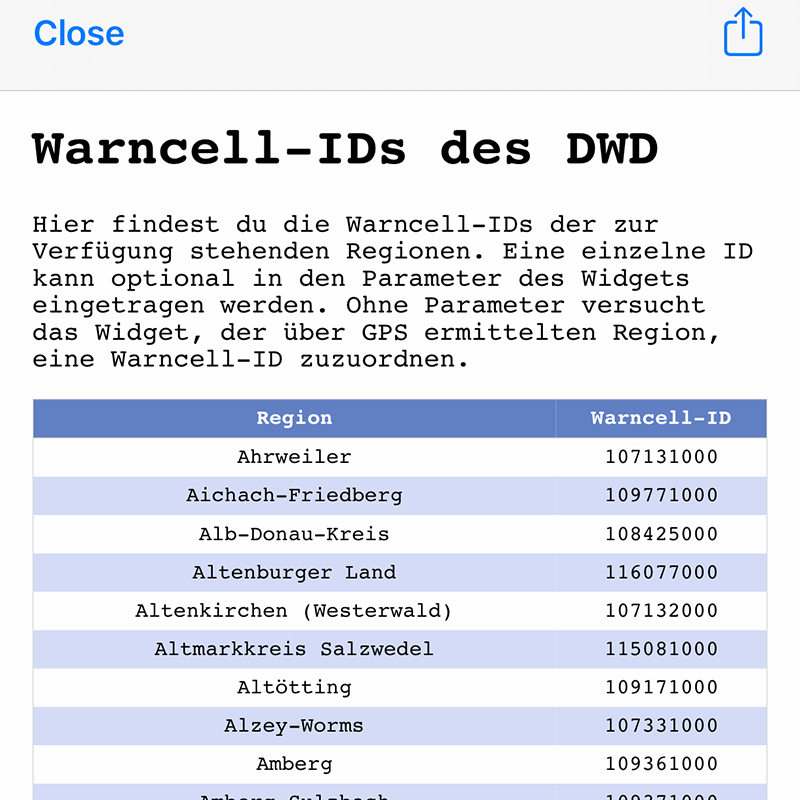

# WarnWetter -  Ein Scriptable Widget für iOS und Mac
Das Widget zeigt regionale Warnmeldungen des Deutschen Wetterdienstes (DWD) an.  
Verwendbar als kleines, mittleres oder großes (empfohlen!) Widget.

## Installation und Verwendung
* Download Scriptable App für iOS oder Mac - https://scriptable.app
* Download/Import der ImpfQuoten.js Datei nach iCloud/Scriptable
* Auf dem Homescreen bzw. in der Mitteilungszentrale ein neues Scriptable Widget (groß) erstellen.
* Die Auswahl der Region (Bezug auf Landkreis) kann über die Vorgabe der Warncell-ID als Widgetparameter erfolgen. Eine Tabelle mit den notwendigen IDs wird angezeigt, wenn das Skript in der Scriptable App ausgeführt wird.
* Wird keine Warncell-ID dem Widget vorgegeben, wird via GPS die Region ermittelt und es wird versucht die zugehörige ID zu ermitteln.  
 &nbsp; 

## ScriptDude
Alternativ kann das Script via <a href="https://scriptdu.de" target="_blank">ScriptDude</a> installiert werden. 

## Features
* Untestützung bei der Auswahl einer Warncell-ID direkt in der Scriptable App.
* Je nach Geräteeinstellung erfolgt ein automatischer Wechsel des Ernscheinungsbildes.
* Anzeige einer beliebigen Region über die Vorgabe der Warncell-ID.
* Region wird via GPS erkannt.
* Anzeige von bis zu 3 Warnmeldungen (im großen Widget)
* Wenn keine oder wenige Warnmeldungen aktiv sind, wird die allgemeine Wetterlage Deutschlands angezeigt.
* Für mehr Details reicht ein Tap bzw. Klick auf das Widget und die Internetseite des DWD wird geöffnet.

## Beispiele
 &nbsp;   
 &nbsp;  

## Bekannte Probleme
* Verzögerung und Fehlermeldung bei der GPS-Lokalisierung Das Problem tritt sporatisch auf und nach kurzer Zeit aktuallisiert sich die Widgetanzeige korrekt.

## Quellen
* Basis ist die bereitgestellte JSONP-File vom DWD https://www.dwd.de/DE/wetter/warnungen_aktuell/objekt_einbindung/objekteinbindung.html
* Warncell-IDs  https://www.dwd.de/DE/leistungen/opendata/help/warnungen/cap_warncellids_csv.html
* Allgemeine Wetterlage  https://www.dwd.de/DWD/wetter/wv_allg/deutschland/text/vhdl13_dwog.html

## Changelog
* v1.5 Release GitHub

## Dankeschön an...
* ...Dennis für den Projektvorschlag
* ...Florian und Dennis für die ersten Tests und die kontruktiven Verbesserungsvorschläge
* ...die Scritabple Community und 
* ...den DWD zum Bereitstellen der Daten
